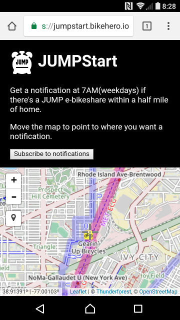

# JUMP Start your day with an e-bike commute!
A web app leveraging service workers and web-push with a serverless backend leveraging
[JUMP's API](https://dc.jumpmobility.com/opendata) against your location and sends a push
notification at 7AM.

## Discontinued
I've disabled jumpstart.bikehero.io since new the news of JUMP's acquisition by
Uber. This is because I have ethical qualms with the way Uber behaves itself.
If you want to deploy JUMPStart yourself, checkout the `pre-sunset` tag and
follow the directions in the readme.

### A screenshot

