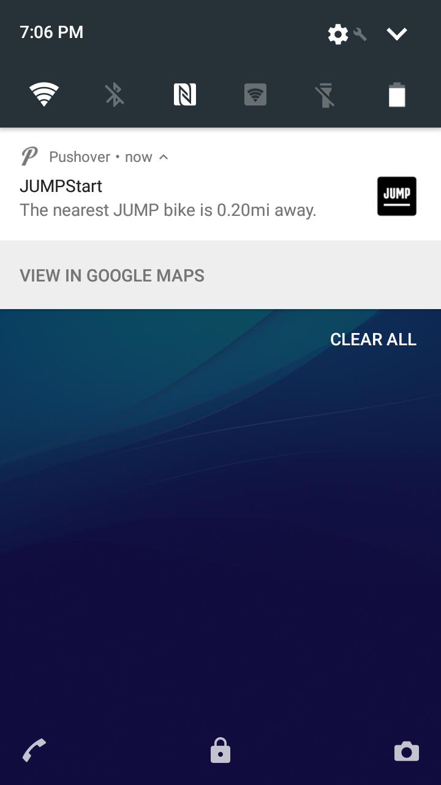

# JUMP Start your day with an e-bike commute!
This is an simple serverless function that checks
[JUMP's API](https://dc.jumpmobility.com/opendata) against my location and sends a push
notification at 7AM using [Pushover](https://pushover.net).

### A screenshot

